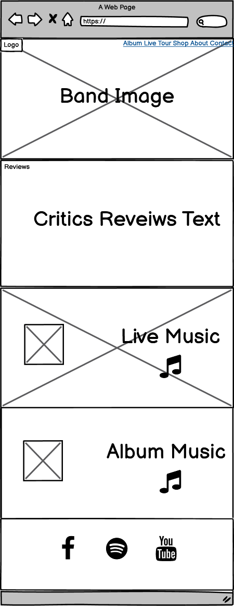
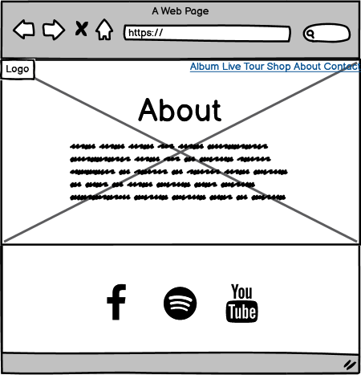
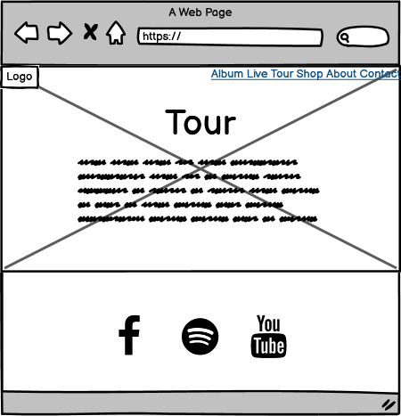

# Lankum Band Website

For current Lankum fans this is a website intended to increase music sales, showcase new music, and provide info on tours.

For new fans or those that have heard good things through the media or word of mouth, this website serves as a hub that will provide info about Lankum, provide music, and direct them to social media to learn more. 
 
## UX
 
### Business goals

* To sell music and merchendise
* Get booked for events

### Developer Goals

* Increase bands income from spotify
* Gain greater website listenership by providing a better way to listen to Lankum than the current site
* Style the website to suit the bands image
* Streamline the users route to hearing music 

### User stories

* Jack is a fan, and would like to stream music on his phone to show a friend. He goes to the website to do this.
* Jane has recently heard of the band. She wants to visit the website so she can learn about Lankum by listening to music and finding info.
* Joe is a current fan and wants to find info about upcomming events so he can organise going to a gig.
* Jemima is an event manager at a medium size venue and wants to find Lankums contact info so she can make a booking.
* Alan is a fan and wants to stream music from the website to listen to on a walk.

### Design choices

#### The homepage

An about section was left out and replaced with good crital reviews from authoratative sources. This was chosen because if it's a new user visiting the site curious about the band, like from word of mouth or media sources, this will make a good impression. Also if it's someone considering booking the band, this will reinforce their decision to some degree. Therefore, it was the first section after the header.

The about information is on a seperate page which anyone looking for this info will be used to looking to the navigation for an about page anyway.

The homepage features a section for live music which can be listened to fully and a spotify section that plays samples but can be listenined to fully if the user signs in to spotify.

For a band of medium/low fame like lankum, they won't be selling many live albums yet. Providing live tracks costs the band nothing but provides value to the user by getting free music, and value to the band by giving samples of their work and an impression of what their live shows would be like. This could potentially increase tickets sales and music sales once the user decides they like the music.

The spotify section was chosen because if a user does sign in to spotify to listen, the band will gain royalties from it. It also has an image and title advertising the new album beside it.

The navigation links for these two sections use scroll spy so to speed up the process for the user helping ensure they don't get distracted while using the site and drop off before listening. In a situation where someone is trying to show a friend the music, it will speed it up and reduce silences and social discomfort while attempting to get the music playing.

#### Footer 

The footer was kept simple with only links to social media and spotify. This is because quicklinks contact info isn't totally neccessary for a band because, one, the navigation is sticky and will always be there for the user, and two, bands of this stature usually are contacted by email or through agencies. It seemed better to not look too busy in the footer and not distract from the social media links as they will be more likely to be used then.

#### about and tour page

They were left to a standered layout but with promotional images of the band and album. It stays consistent with the homepage visual design and show the band in their folky brand look. They have there own pages which from research seems to be usual for band's pages.

#### General visual design

Lots of band images to attract new users to their look and keep the images and tone a little darker reminiscent of what the darker sets that folk bands play.

### wireframes

 
 
 
 

## Features

 
### Existing Features

* The navigation is conventional and will be intuitive to the user. It is set to sticky to allow the user to navigate to any page or music section of the homepage they like at all times. A bonus being that it gives more clarity for direction to external social media sites allowing for a less busy footer by freeing up space.
* There is a music player that will allow new and previous users to listen to live tracks of the band for free. It is set to load only when a user interactacts with it so as to speed up page loading time allowing for a better UX.
* There is a spotify iframe embedded which will allow spotify users to listen to the music for free, adding value to the user for convenience and value to the band in royalties.
* On the bands current website, only video can be accessed free. This is an inconvenient way to listen because if a user is exorcising or doing other tasks, they can't put their phone in their pocket and be active.
* There is a form for people that would like to enquire about booking a show. 

### Features Left to Implement
* A video was originally in the homepage header with a poster of the current header img used as the video thumbnail. A bug was stopping the video from loading and I didn't have the skills to fix it quick enough.
* The shop is an external link to the bands Amazon page. An ecommerce feature would be implemented if I have the skills and knowledge. It looks more proffesional and stays within the site which is more convenient to the user.

## Technologies Used

- [Bootstrap 4](https://getbootstrap.com/)
    - The project uses **Bootstrap** to ease repetitive coding. The grid system simplied the building process.

- [Spotify Widget](https://developer.spotify.com/documentation/widgets/generate/embed/)
    - The project uses **Spotify Widget** to provide users with access to the bands spotify pages.

- [FontAwesome](https://fontawesome.com/)
    - The project uses **FontAwesome** for any icons used throughout the site.

- [jquery](https://jquery.com/)
    - Used by Bootstrap to provide functionality

## Testing
The responsiveness of the site was initially tested by changing the browser size manually. If it seemed good then Chrome dev tools were used at all sizes from near 300px wide phones up to full hd screens.
There were some discrepancies between these results and what was displayed when the website went live, but these were then fixed.

There was a bug happening when superimposing the nav onto the header img on the homepage. It was leaving white space the height of the nav between the header and the below section.  This seemed to be a position property issue and was resolved by using calc() and subtracting the nav height from the value given to the header. header {height: calc(100vh - (The height of the nav))}
The header video discussed earlier had a bug that couldn't be resolved. Best guess is a position property issue.
## Deployment
The assets, html, and css files were added or created on Gitpod, which is linked to a repository on Github and was used throughout the project to upload files for editing or using.
Github was used parallel to gitpod. Many commits were made and pushed to the repository. To deploy the site, the repository was given the same name as the username, then gh-pages branch was applied to the repository which deployed it to the link below. 

[Gerard-Mc](https://gerard-mc.github.io/Gerard-Mc/index.html)

## Credits

### Content
- The text for the whole website was taken from Lankum's current site [Lankum](http://lankumdublin.com/)

### Media
- The photos for the whole website was taken from Lankum's current site [Lankum](http://lankumdublin.com/)

### Acknowledgements

- I recieved inspiartion from the lankums website and their image and music.
